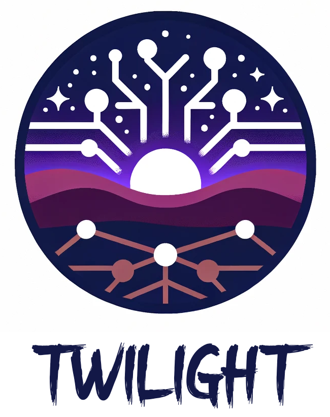

# Twilight Chat

<p align="center">

</p>
Twilight Chat is a virtual book club host that helps elderly to engage in reading activities, in order to help 
mediate cognitive declines. 


## Concept

As chatbots evolve, ...

## Features

- **Flexible Integration**: Develop chatbots for various front-end delivery mechanisms, integration with Twilio and other system.
- **Database Integration**: Robust support for databases to store and retrieve essential chatbot data.
- **Language Model Integration**: Seamless integration with third-party LLMs like OpenAI or self-hosted models.
- **API Deployment**: Deploy your chatbot logic as a scalable API, ready to integrate with various front-end channels.
- **Developer-Centric Tools**: Comprehensive tools, from conversation flow design to testing and deployment.


## Getting Started

<!-- This section should contain installation instructions, basic setup, and a "hello world" example. -->

1. Clone the repository:
```bash
git clone https://github.com/your_username/twilight_chat_framework.git
```

2. Set up your environment:

Copy `example.env` into `.env` and change the values.

3. Docker:

You need to use `host.docker.internal` instead of `localhost` for docker to access vllm on the host machine.

To just run the app:
```bash
docker build -t twilight .
docker run --env-file ./.env -p 1680:1680 -d twilight
```

Hot reload during development:
```bash
docker run -v $(pwd):/app --env-file ./.env -p 1680:1680 --add-host=host.docker.internal:host-gateway twilight \
python -m chainlit run /app/app.py -h --port 1680 -w
```

Create and activate your python virtual env:
```bash
python -m venv .venv
source .venv/bin/activate
```

Install dependencies:
```bash
pip install -r requirements.txt
```

3. Run chainlit chatbot:

```bash
chainlit run app.py -w
```

## Contributing
We welcome contributions! Whether it's bug reports, feature requests, or pull requests, we encourage you to share and contribute to Twilight's growth. Please read our CONTRIBUTING.md for guidelines on how to contribute.

## License
This project is licensed under the Apache 2.0 License - see the LICENSE.md file for details.

## Acknowledgements
Thanks to all our contributors and supporters.

